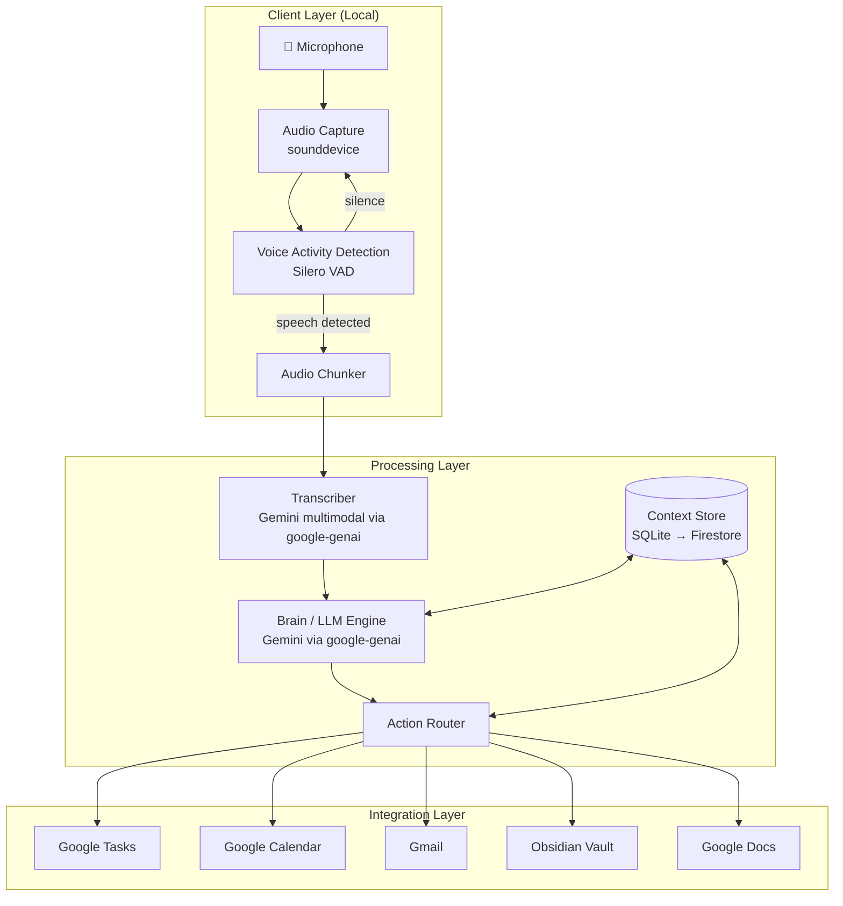

# Avin — Personal Voice Assistant

Avin is a context-aware, always-listening voice assistant that captures spoken thoughts, extracts actionable insights, and integrates with your productivity tools. It acts as a second brain — remembering past conversations and routing actions (to-dos, calendar events, emails, notes) to the right place, automatically or with your confirmation.

---

## Architecture



**Data flow (single utterance):**
1. `sounddevice` captures raw PCM audio at 16 kHz mono
2. Silero VAD runs locally — only speech segments are processed, silence is discarded
3. Gemini multimodal transcribes the audio segment to text
4. Gemini reasons over the transcript + recent conversation context, producing structured JSON (note + action items)
5. The action router dispatches each extracted intent (create todo, send email, add calendar event, research topic)

---

## Prerequisites

| Requirement | Notes |
|-------------|-------|
| Python 3.12+ | Check with `python --version` |
| Google Cloud project | With Vertex AI API enabled |
| Application Default Credentials | Run `gcloud auth application-default login` |
| Microphone | Built-in or USB; list devices with `avin devices` |

---

## Setup

```bash
# 1. Clone
git clone https://github.com/AvinFdo/note-assistant.git
cd note-assistant

# 2. Create and activate a virtual environment
python -m venv venv
source venv/bin/activate          # macOS/Linux
# venv\Scripts\activate           # Windows

# 3. Install with dev dependencies
pip install -e ".[dev]"

# 4. Configure
#    Edit config/default.yaml, or set environment variables:
export AVIN_GCP_PROJECT_ID="your-gcp-project-id"
export AVIN_GCP_REGION="us-central1"

# 5. Authenticate with Google Cloud
gcloud auth application-default login
```

---

## Configuration

All tunables live in `config/default.yaml`. Override any value with an `AVIN_<SECTION>_<KEY>` environment variable — no source code changes needed.

```bash
AVIN_GCP_PROJECT_ID=my-project   # overrides gcp.project_id
AVIN_GCP_REGION=us-east1         # overrides gcp.region
AVIN_AUDIO_SAMPLE_RATE=16000     # overrides audio.sample_rate
AVIN_CONFIG_PATH=/path/to/custom.yaml  # load a different config file
```

Point `AVIN_CONFIG_PATH` to a different YAML file to use environment-specific configs (e.g., for local vs. Raspberry Pi vs. Cloud Run).

---

## Usage

```bash
# Record for 10 seconds (default), transcribe, and extract notes/actions
avin listen

# Continuous listening — process each speech segment until Ctrl+C
avin listen --continuous

# Record for a fixed duration
avin listen --duration 30

# Show recent notes in a formatted table
avin history

# Search notes by keyword
avin search "project budget"

# Show recent and pending actions
avin actions

# Confirm a specific pending action
avin actions confirm <action-id>

# Replay a past conversation (full transcript + extracted data)
avin replay <conversation-id>

# Print current configuration (sensitive values masked)
avin config

# List available audio input devices
avin devices
```

> **Note:** `avin listen`, `avin history`, and other commands are fully implemented in task 1.8.1. Running them now will show the help text only.

---

## Project Structure

```
note-assistant/
├── src/assistant/          # Main package
│   ├── config.py           # Config singleton — loads config/default.yaml
│   ├── audio.py            # AudioRecorder — mic capture, device listing
│   ├── transcriber.py      # Transcriber — audio → text via Gemini
│   ├── brain.py            # Brain — context assembly, LLM reasoning
│   ├── memory.py           # Memory — SQLite CRUD, context retrieval
│   ├── vad.py              # VADProcessor — Silero VAD integration
│   ├── cli.py              # Click CLI — all avin subcommands
│   └── actions/
│       ├── base.py         # Abstract Action class
│       ├── todo.py         # CreateTodoAction
│       ├── email.py        # SendEmailAction
│       ├── calendar.py     # AddCalendarAction
│       └── research.py     # ResearchTopicAction
├── tests/                  # pytest tests (always use mocks, never live APIs)
│   └── conftest.py         # Shared fixtures
├── config/
│   └── default.yaml        # All tunables
├── recordings/             # WAV files (gitignored)
├── data/                   # SQLite database (gitignored)
├── docs/
│   ├── PROJECT_BRIEF.md    # Architecture, schemas, prompt design
│   └── BACKLOG.md          # All 72 tasks with acceptance criteria
└── pyproject.toml          # PEP 621 project + ruff + pytest config
```

---

## Development

```bash
# Run tests (mocks only — never live API calls)
pytest

# Lint
ruff check .

# Format
ruff format .

# After adding a new module, reinstall to pick it up
pip install -e ".[dev]"
```

### Branch & PR workflow

One task = one branch = one PR. Keep PRs small and reviewable.

```bash
git checkout -b stage-<id>-<slug>   # e.g. stage-1.2.1-audio-recorder
# implement …
ruff check . && pytest              # must be green before opening PR
git push -u origin <branch>
gh pr create --title "<task-id> — <title>"
```

- Reference the task ID (e.g. `1.2.1`) in the PR title.
- In the same PR, flip `[ ]` → `[x]` in `docs/BACKLOG.md` and advance the **Current Focus** marker.
- CI must be green to merge.

### Cost guardrails

VAD filtering is the primary cost lever — silence never leaves the device. Keep `vad.threshold` tuned to avoid false positives (background noise processed as speech wastes API quota). Billing alerts are set at $10 and $20/month.
