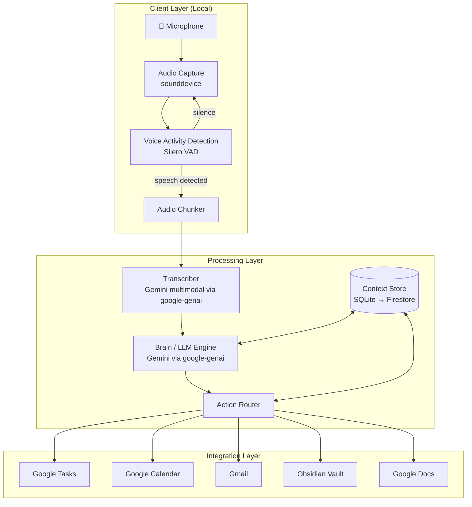

# Project Brief: Avin — Note-Taking Personal Assistant

## 1. Vision & North Star

Build a context-aware, always-listening personal assistant device that captures conversations, extracts actionable insights, and integrates with the user's existing productivity tools. The assistant should feel like a second brain — remembering past conversations, understanding who is speaking, and proactively surfacing relevant information.

**Form factors (in order of development):**
1. Desktop software prototype (current)
2. Cloud-hosted service
3. Raspberry Pi desk companion
4. Portable/wearable custom hardware

---

## 2. User Profile & Requirements

| Dimension | Requirement |
|-----------|-------------|
| **Primary use** | Personal desk companion + portable thought capture |
| **Listening mode** | Hybrid — always listening, but only processes/saves when explicitly asked or when actionable content is detected |
| **Context awareness** | Long-term memory across sessions + contextual speaker profiles |
| **Note delivery** | Integration with existing tools (Obsidian, Google Docs) |
| **Action execution** | Configurable per action — some auto-execute, some require confirmation |
| **Speaker diarization** | Not now, but planned for a future stage |
| **Language** | English only |
| **Audio environment** | Open office / shared space with moderate background noise |
| **Budget** | Under $20/month for cloud costs |
| **Timeline** | Learning project — understanding and quality over speed |
| **Programming** | Python, comfortable — build efficiently |
| **Version control** | Full Git workflow (branches, PRs, CI) |

### Tool Integrations (Priority Order)
1. **Google Calendar** — Create events, check availability
2. **Google Tasks / Google Keep** — Create to-do items
3. **Gmail** — Draft and send emails
4. **Obsidian** — Save notes as markdown files to a vault
5. **Google Docs** — Create/append to documents

---

## 3. System Architecture

### 3.1 — High-Level Architecture



### 3.2 — Data Flow (Single Utterance)

This is the complete journey of a single spoken sentence through the system:

```
1. AUDIO CAPTURE
   User speaks → sounddevice captures raw PCM audio at 16kHz mono
   
2. VOICE ACTIVITY DETECTION (Local)
   Silero VAD runs on raw audio frames (every 30ms)
   → If silence: discard frames, keep rolling buffer
   → If speech: start accumulating frames
   → If speech → silence (>1.5s gap): segment is complete, emit chunk
   
3. TRANSCRIPTION
   Audio chunk (WAV bytes) → google-genai multimodal API
   → Returns: plain text transcript
   → Saved to: conversations table in SQLite
   
4. CONTEXT ASSEMBLY
   brain.py queries memory.py for:
   → Last 5 conversation transcripts (recency window)
   → Any pending/recent actions (what's already on the to-do list?)
   → Rolling context keys (user preferences, known contacts)
   
5. LLM PROCESSING
   Assembled prompt → Gemini API (structured JSON output mode)
   → Returns: { summary_note, actions[], is_noteworthy }
   → If is_noteworthy=false: log transcript but don't create a note
   
6. PERSISTENCE
   → Note saved to: notes table
   → Actions saved to: actions table (status="pending")
   → Context updated: context_window table
   
7. ACTION ROUTING
   For each action:
   → Check config: auto_execute / confirm_first / log_only
   → If auto_execute: call integration, update status to "completed"
   → If confirm_first: display to user, wait for approval
   → If log_only: leave as "pending", user acts manually
```

### 3.3 — Key Architecture Decisions

> [!IMPORTANT]
> **Unified SDK:** Use `google-genai` for everything — both STT (via Gemini multimodal audio input) and LLM processing. This eliminates the dependency split between `google-cloud-speech` and `google-genai`, simplifies auth (single ADC flow), and reduces the dependency tree. The `google-genai` SDK supports sending audio files directly to Gemini models, which can transcribe and reason about them in a single call.

> [!IMPORTANT]
> **Hybrid Listening:** The client runs Voice Activity Detection (VAD) locally using Silero VAD (a lightweight PyTorch model, ~2MB). Audio is only sent to the cloud when speech is detected. This means:
> - No cloud costs during silence (which is most of the day)
> - Privacy-friendly: silence is never transmitted
> - Low latency: VAD runs in <10ms per frame locally
> - The rolling buffer (3 seconds) ensures we never miss the beginning of a sentence

> [!IMPORTANT]
> **Two-Step vs Single-Step Processing:** We could send audio directly to Gemini and ask it to both transcribe AND extract actions in one call. However, we deliberately separate transcription from action extraction because:
> - We want to store the raw transcript independently (for search, replay, context)
> - We want the ability to re-process old transcripts with improved prompts without re-transcribing
> - STT and action extraction may eventually run on different infrastructure (edge STT, cloud LLM)

> [!NOTE]
> **Context Store:** For the local prototype, use SQLite (zero infrastructure, single file, portable). For the cloud deployment, migrate to Firestore (stays within GCP, free tier covers our volume). The context store holds conversation transcripts, extracted notes, speaker profiles, and action history — this is what enables long-term memory.

> [!NOTE]
> **Why SQLite for Stage 1 instead of jumping to Firestore:** SQLite works offline, has zero setup, and lets us iterate on the schema rapidly. The `memory.py` module will abstract the storage layer so the migration to Firestore in Stage 2 is a swap of the implementation, not a rewrite of the consumers.

---

## 4. Database Schema

### SQLite Schema (Stage 1)

```sql
-- Each recording session or continuous-listening segment
CREATE TABLE conversations (
    id          TEXT PRIMARY KEY,    -- UUID
    started_at  TEXT NOT NULL,       -- ISO 8601 timestamp
    ended_at    TEXT,                -- NULL if still active
    transcript  TEXT NOT NULL,       -- Full raw transcript text
    audio_path  TEXT,                -- Path to WAV file (nullable, for replay)
    created_at  TEXT NOT NULL DEFAULT (datetime('now'))
);

-- Extracted notes (the "second brain" content)
CREATE TABLE notes (
    id              TEXT PRIMARY KEY,    -- UUID
    conversation_id TEXT NOT NULL,       -- FK to conversations
    summary         TEXT NOT NULL,       -- LLM-generated summary
    is_noteworthy   INTEGER DEFAULT 1,   -- 1=real note, 0=logged but filtered out
    created_at      TEXT NOT NULL DEFAULT (datetime('now')),
    FOREIGN KEY (conversation_id) REFERENCES conversations(id)
);

-- Extracted actions (to-do, email, calendar, research)
CREATE TABLE actions (
    id              TEXT PRIMARY KEY,    -- UUID
    conversation_id TEXT NOT NULL,       -- FK to conversations
    intent          TEXT NOT NULL,       -- 'create_todo' | 'send_email' | 'add_calendar' | 'research_topic'
    details         TEXT NOT NULL,       -- JSON string with action-specific fields
    status          TEXT NOT NULL DEFAULT 'pending',  -- 'pending' | 'confirmed' | 'executed' | 'dismissed'
    execution_mode  TEXT NOT NULL,       -- 'auto_execute' | 'confirm_first' | 'log_only'
    executed_at     TEXT,                -- When the action was actually executed
    created_at      TEXT NOT NULL DEFAULT (datetime('now')),
    FOREIGN KEY (conversation_id) REFERENCES conversations(id)
);

-- Rolling context window (key-value store for persistent context)
-- Examples: "user_name"="Avin", "current_project"="Note Assistant", 
--           "known_contacts"=JSON list of names/emails
CREATE TABLE context_window (
    key         TEXT PRIMARY KEY,
    value       TEXT NOT NULL,
    updated_at  TEXT NOT NULL DEFAULT (datetime('now'))
);
```

### Firestore Schema (Stage 2)

```
users/{userId}/
  conversations/{conversationId}
    - started_at, ended_at, transcript, audio_url
  notes/{noteId}
    - conversation_id, summary, is_noteworthy, created_at
  actions/{actionId}
    - conversation_id, intent, details, status, execution_mode
  context/{key}
    - value, updated_at
```

---

## 5. Configuration Schema

All configurable values live in `config/default.yaml`. No hardcoded values in source code.

```yaml
# config/default.yaml

# --- Google Cloud ---
gcp:
  project_id: "project-7255c67e-8145-4cdd-ae1"
  region: "us-central1"

# --- AI Models ---
models:
  transcription: "gemini-2.5-flash"    # Model used for audio-to-text
  reasoning: "gemini-2.5-flash"        # Model used for note/action extraction

# --- Audio ---
audio:
  sample_rate: 16000          # Hz — 16kHz is optimal for speech
  channels: 1                 # Mono — sufficient for speech, saves bandwidth
  format: "int16"             # 16-bit PCM
  recordings_dir: "recordings"

# --- Voice Activity Detection ---
vad:
  enabled: true
  model: "silero"
  threshold: 0.5              # Confidence threshold (0.0-1.0), higher = less sensitive
  min_speech_duration_ms: 250 # Minimum speech duration to trigger processing
  silence_duration_ms: 1500   # Silence duration to consider speech segment complete
  buffer_duration_s: 3.0      # Rolling buffer size in seconds (captures pre-speech audio)

# --- Context & Memory ---
memory:
  db_path: "data/assistant.db"
  context_window_size: 5      # Number of recent conversations to include in LLM prompt
  max_context_tokens: 4000    # Approximate token budget for context in the prompt

# --- Actions ---
actions:
  create_todo:
    mode: "auto_execute"       # Safe — just creates a to-do item
  send_email:
    mode: "confirm_first"      # Dangerous — never auto-send emails
  add_calendar:
    mode: "confirm_first"      # Could disrupt schedule
  research_topic:
    mode: "auto_execute"       # Safe — just queues for research

# --- Integrations (Stage 2) ---
integrations:
  obsidian:
    vault_path: ""             # Absolute path to Obsidian vault
    notes_folder: "assistant"  # Subfolder within vault for assistant notes
  google:
    oauth_credentials_path: "" # Path to OAuth2 client secret JSON
```

---

## 6. LLM Prompt Architecture

The prompt sent to Gemini is assembled dynamically from multiple sources. This is the core of the "brain."

### Prompt Template

```
SYSTEM:
You are Avin, an intelligent note-taking and action-extraction assistant.
You are analyzing a transcribed conversation segment from your user's day.

Your responsibilities:
1. Determine if this segment contains noteworthy information (not all speech is important).
2. If noteworthy, write a concise summary note capturing the key points.
3. Extract any actionable intents from the following categories:
   - create_todo: Tasks the user needs to do
   - send_email: Intent to communicate via email (extract recipient, subject, body)
   - add_calendar: Intent to schedule something (extract title, datetime, attendees)
   - research_topic: Topics the user wants to learn about

CONTEXT (Recent History):
{last_n_conversation_summaries}

CONTEXT (Known Information):
{context_window_key_values}

CONTEXT (Pending Actions):
{recent_pending_actions}

CURRENT TRANSCRIPT:
"{current_transcript}"

Respond using the provided JSON schema.
```

### Structured Output Schema (Gemini JSON Mode)

```json
{
  "type": "object",
  "properties": {
    "is_noteworthy": {
      "type": "boolean",
      "description": "Whether this transcript contains information worth saving as a note"
    },
    "summary_note": {
      "type": "string",
      "description": "A concise summary of the key points. Empty string if not noteworthy."
    },
    "actions": {
      "type": "array",
      "items": {
        "type": "object",
        "properties": {
          "intent": {
            "type": "string",
            "enum": ["create_todo", "send_email", "add_calendar", "research_topic"]
          },
          "confidence": {
            "type": "number",
            "description": "0.0 to 1.0 confidence that this action was genuinely intended"
          },
          "details": {
            "type": "object",
            "description": "Action-specific fields (task, recipient, subject, body, title, time, topic, etc.)"
          }
        },
        "required": ["intent", "confidence", "details"]
      }
    }
  },
  "required": ["is_noteworthy", "summary_note", "actions"]
}
```

> [!TIP]
> The `confidence` field is critical for the hybrid listening mode. If confidence is below a configurable threshold (e.g., 0.7), the action is logged but NOT executed or surfaced — preventing hallucinated actions.

---

## 7. Project Structure

```
note-assistant/
├── src/
│   └── assistant/
│       ├── __init__.py            # Package init, version
│       ├── config.py              # Loads config/default.yaml, exposes typed Config object
│       ├── audio.py               # AudioRecorder class — mic capture, device listing
│       ├── transcriber.py         # Transcriber class — audio → text via google-genai
│       ├── brain.py               # Brain class — assembles context, calls LLM, parses response
│       ├── memory.py              # Memory class — SQLite CRUD, context retrieval
│       ├── vad.py                 # VADProcessor class — Silero VAD integration
│       ├── actions/
│       │   ├── __init__.py        # Action registry, router
│       │   ├── base.py            # Abstract Action class (execute, confirm, log)
│       │   ├── todo.py            # CreateTodoAction (mock → Google Tasks)
│       │   ├── email.py           # SendEmailAction (mock → Gmail)
│       │   ├── calendar.py        # AddCalendarAction (mock → Google Calendar)
│       │   └── research.py        # ResearchTopicAction (mock → queued search)
│       └── cli.py                 # Click CLI — listen, history, search, replay, config
├── tests/
│   ├── conftest.py                # Shared fixtures (in-memory SQLite, mock config)
│   ├── test_brain.py              # Tests with mocked LLM responses
│   ├── test_memory.py             # SQLite CRUD tests
│   ├── test_actions.py            # Action routing and execution tests
│   └── test_config.py             # Config loading tests
├── config/
│   └── default.yaml               # Default configuration (see Section 5)
├── recordings/                    # .gitignored — WAV files from recordings
├── data/                          # .gitignored — SQLite database
├── .github/
│   └── workflows/
│       └── ci.yml                 # GitHub Actions — lint + test on push
├── pyproject.toml                 # Dependencies, build config, tool settings
├── README.md                      # Setup instructions, architecture overview, usage
└── .gitignore
```

---

## 8. Technology Stack

| Layer | Technology | Version | Rationale |
|-------|-----------|---------|-----------|
| Language | Python | 3.12+ | Comfortable, rich ecosystem for audio + AI |
| AI SDK | `google-genai` | latest | Unified library for STT + LLM, ADC auth, supports multimodal |
| LLM Model | `gemini-2.5-flash` | — | Fast, cost-effective, large context window, structured output support |
| VAD | Silero VAD | v5+ | Free, MIT licensed, ~2MB model, runs on CPU, no GPU needed |
| Audio | `sounddevice` | latest | Cross-platform, simple API, wraps PortAudio |
| Local DB | SQLite | built-in | Zero setup, portable, single file, perfect for prototyping |
| Cloud DB | Firestore | — | GCP-native, generous free tier, serverless |
| API Framework | FastAPI | latest | Async, WebSocket support, auto-generated OpenAPI docs |
| Cloud Hosting | Cloud Run | — | Scales to zero (no cost when idle), GCP-native, Docker-based |
| CLI | `click` + `rich` | latest | Clean command structure + beautiful terminal output |
| Testing | `pytest` | latest | Standard Python testing, fixtures, mocking |
| CI/CD | GitHub Actions | — | Free for public repos, integrates with PR workflow |
| Config | PyYAML | latest | Human-readable YAML config files |
| Version Control | Git + GitHub | — | Branching, PRs, code review |

---

## 9. API Contracts (Stage 2)

### REST Endpoints

| Method | Endpoint | Description | Request Body | Response |
|--------|----------|-------------|-------------|----------|
| `GET` | `/api/v1/notes` | List notes (paginated) | Query: `?limit=20&offset=0` | `{ notes: [...], total: N }` |
| `GET` | `/api/v1/notes/{id}` | Get single note with conversation | — | `{ note, conversation, actions }` |
| `GET` | `/api/v1/actions` | List actions (filterable) | Query: `?status=pending&intent=create_todo` | `{ actions: [...] }` |
| `PATCH` | `/api/v1/actions/{id}` | Update action status | `{ status: "confirmed" }` | `{ action }` |
| `POST` | `/api/v1/search` | Semantic search over notes | `{ query: "meeting with John" }` | `{ results: [...] }` |
| `GET` | `/api/v1/context` | Get current context window | — | `{ context: { key: value } }` |

### WebSocket Endpoint

```
WS /api/v1/stream

Client → Server:
  Binary frames: raw PCM audio chunks (16kHz, mono, int16)
  Text frames:   { "type": "control", "action": "stop" }

Server → Client:
  { "type": "transcript",  "text": "...", "conversation_id": "..." }
  { "type": "note",        "summary": "...", "note_id": "..." }
  { "type": "action",      "intent": "...", "details": {...}, "action_id": "...", "needs_confirmation": true }
  { "type": "error",       "message": "..." }
```

---

## 10. Budget Estimate (Monthly)

| Service | Free Tier | Estimated Usage | Estimated Cost |
|---------|-----------|-----------------|----------------|
| Gemini API (Vertex AI) | Generous free tier for flash models | ~100 calls/day | $0-5 |
| Cloud Run | 2M requests/month, 360K vCPU-seconds | Scales to zero when idle | $0-3 |
| Firestore | 1GB storage, 50K reads/day | Light personal use | $0 |
| Google Workspace APIs | Free for personal accounts | Calendar, Tasks, Gmail | $0 |
| GitHub Actions | 2,000 min/month for free repos | CI on push | $0 |
| **Total** | | | **$0-8/month** |

> [!TIP]
> The biggest cost saver is VAD filtering. In a typical 8-hour workday, actual speech might be 1-2 hours. Without VAD, we'd process 8 hours of audio. With VAD, we process 1-2 hours — an 75-87% cost reduction.

---

## 11. Risks & Mitigations

| Risk | Impact | Likelihood | Mitigation |
|------|--------|------------|------------|
| LLM hallucinates actions | Creates false to-dos, sends wrong emails | Medium | Default `confirm_first` for destructive actions; `confidence` threshold filtering |
| Audio quality in noisy environments | Poor transcription → wrong actions | High | Directional/beamforming mic arrays; VAD sensitivity tuning; noise gate |
| Cloud costs spike unexpectedly | Exceeds $20/month budget | Low | Billing alerts at $10/$20; VAD filters silence; Cloud Run scales to zero |
| Privacy concerns with always-listening | Uncomfortable for colleagues | Medium | LED indicator when listening; physical mute button; local VAD means silence never leaves device |
| Context window limits on LLM | Can't include full conversation history | Medium | Summarize old conversations before including; vector embeddings for semantic retrieval |
| `google-genai` API changes | Breaking changes in the unified SDK | Low | Pin SDK version in `pyproject.toml`; test against pinned version in CI |
| Silero VAD false positives | Processes background noise as speech, wastes API calls | Medium | Tune `threshold` and `min_speech_duration_ms` in config; add a secondary energy-based filter |

---

## 12. Open Questions for User

> [!IMPORTANT]
> **Obsidian vault location:** Where is your Obsidian vault stored? Is it synced via iCloud, Git, or Obsidian Sync? This affects how the assistant writes notes to it.

> [!IMPORTANT]
> **Google Workspace:** Are you using a personal Gmail account or a Google Workspace account? This affects OAuth2 setup for Calendar/Tasks/Gmail APIs.

> [!NOTE]
> **Wake word:** Do you have a preference for what the wake word should be? (e.g., "Hey Avin", "Note this", "Remember that")
